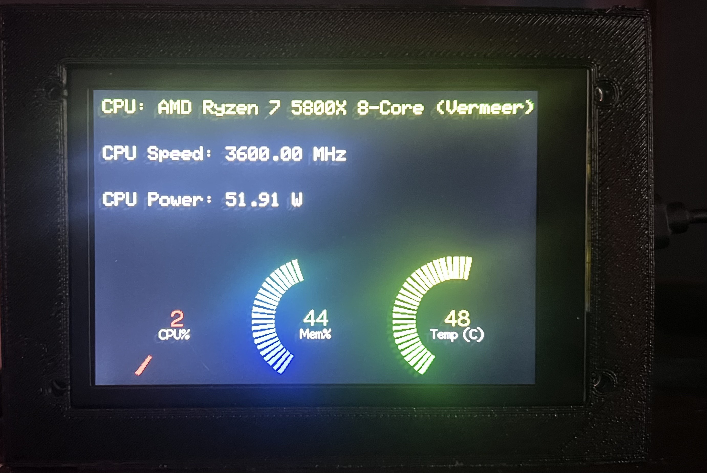

# PC Temperature Monitor

A PC temperature monitoring project using an **ST7996 display**, an **Adafruit Feather HUZZAH ESP8266**, and the **Core Temp** application. This project displays real-time PC temperature data on a physical screen.

---

## Features
- Real-time PC temperature monitoring.
- Wireless communication between PC and Feather HUZZAH.
- Visual temperature display on an ST7996 screen.
- Customizable update intervals and alerts.

---

## Project Description
This project leverages the Adafruit Feather HUZZAH ESP8266 and an ST7996 TFT display to monitor and visually present real-time temperature data from a PC. By integrating the Core Temp application, the system fetches CPU temperature information and transmits it wirelessly to the Feather HUZZAH. The microcontroller processes the data and displays it on the screen, offering a convenient way to track system performance and thermal conditions.

---

## Hardware Requirements
- [Adafruit Feather HUZZAH ESP8266](https://www.adafruit.com/product/2821)
- ST7996-compatible TFT Display
- Jumper wires
- Breadboard or PCB for assembly
- USB cable for programming and power

---

## Software Requirements
- **Arduino IDE**
- Core Temp with the [Remote Server](https://www.alcpu.com/CoreTemp/addons.html) plugin enabled
- Python 3.x (for PC-side script)
- Libraries for Arduino:
  - Adafruit GFX Library
  - TFT_eSPI and SPI Library
  - ESP8266WiFi and ESP8266HTTPClient Library
  - WiFiManager Library

---

## Setup

### Hardware Setup
1. Connect the ST7996 display to the Feather HUZZAH:
    - **MISO**: GPIO12
    - **MOSI**: GPIO13 
    - **SCLK**: GPIO14 
    - **CS**: GPIO15 
    - **DC**: GPIO0 
    - **RST**: GPIO2 
    - **VCC** and **GND** to power.

### Software Setup
#### Core Temp
1. Install Core Temp on your PC.
2. Enable the Remote Server plugin:
    - Go to **Options > Settings > Plugins**.
    - Enable **Remote Server** and set the port (default: 5200).

#### Arduino Code
1. Clone this repository.
2. Open the `temperature_monitor.ino` file in the Arduino IDE.
3. Install the required libraries through the Arduino Library Manager.
4. Upload the code to the Feather HUZZAH.

#### PC-Side Script
1. Start up Core-Temp and enable the Remote Server Plugin
2. Make sure Core-Temp is uploading temperature data. A file is setup to test this.

---

## Usage
1. Power on the Feather HUZZAH and ST7996 display.
2. Start Core-Temp to begin sending updates on port number
3. Monitor real-time temperature data on the ST7996 display.

---

## Contributing
Feel free to fork this repository and submit pull requests for any improvements or new features.

---

## License
This project is licensed under the MIT License. See the `LICENSE` file for details.

---

## Acknowledgments
- [Core Temp](https://www.alcpu.com/CoreTemp/)
- [Adafruit Libraries and Tutorials](https://learn.adafruit.com/)
